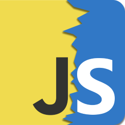
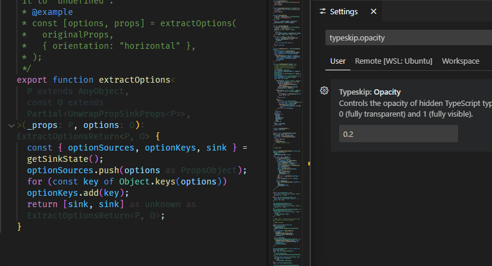
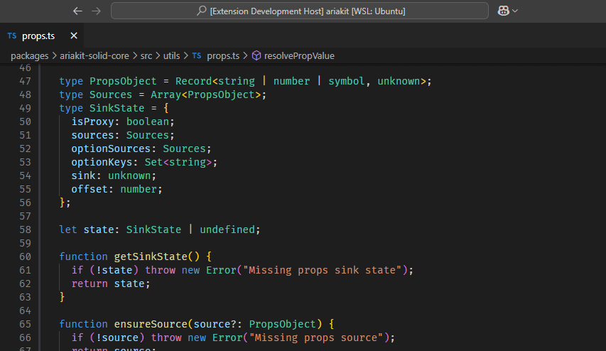
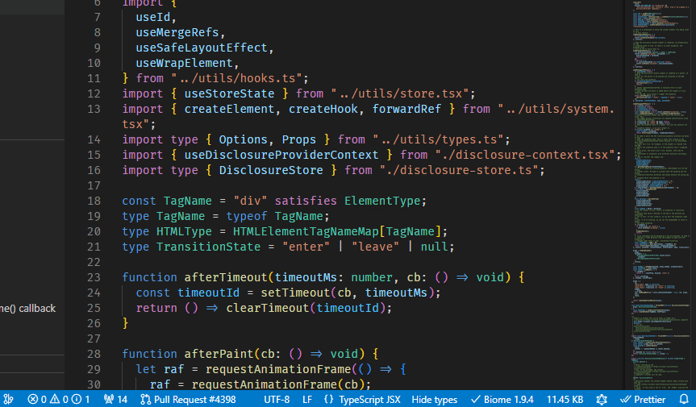

  
  <h1 style="margin: 0; font-size: 2em;">TypeSkip</h1>

Focus on your runtime code by hiding TypeScript types.

TypeSkip lets you hide all **type-specific** code (type aliases, interfaces, type annotations...) in-place when editing `.ts` and `.tsx` files.

Some projects (like libraries) often combine complex types with complex runtime logic, making code hard to understand. With TypeSkip, you can temporarily forget about types and focus on your runtime code instead.

## Features

The opacity of the hidden code can be customized (`typeskip.opacity` setting).

Use commands to hide (and show) TypeScript types in the current workspace or globally.

In the status bar, you can see the current state, toggle it, and quickly jump to the opacity setting.

## Release Notes

### 1.0.0

Initial release.

## Acknowledgements

TypeSkip is inspired and powered by [ts-blank-space](https://bloomberg.github.io/ts-blank-space/), a type-stripping TypeScript compiler. It replaces type-specific code with spaces ("blank space"), leaving valid JavaScript code behind.

Under the hood, this extension compares the original code with the "blanked" code to find the ranges to hide.
